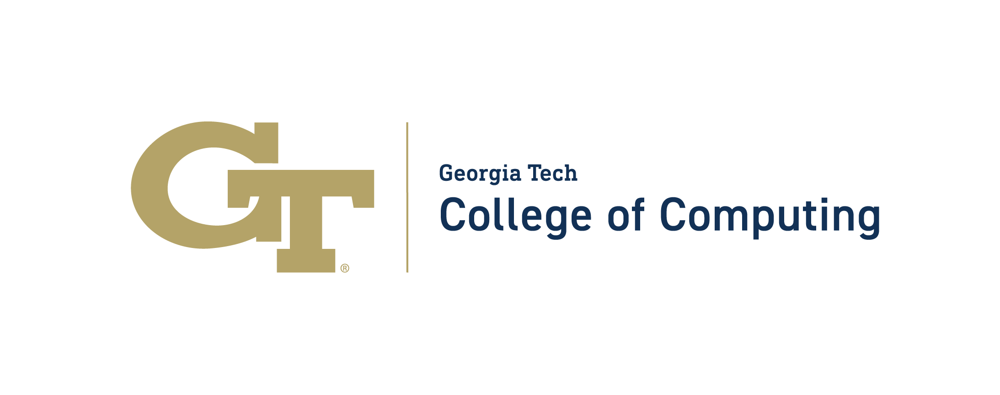

The Georgia Tech <a href="https://ic.gatech.edu/">School of Interactive Computing</a> is hosting the Summit on Responsible Computing, AI, and Society, October 28-30, 2024.

<h1>Overview</h1>

The Summit on Responsible Computing, AI, and Society aims to explore  the future of computing for health, sustainability, human-centered AI, and policy. The summit will bring together luminary researchers in computing for health, sustainability, human-centered AI, and tech policy to lay out the frontiers of these critical fields, and to plot out how they must evolve. 

<h1>Doctoral Consortium</h1>

The Summit will feature a <a href="doctoral-consortium/">Doctoral Consortium</a>, which will offer Ph.D. students opportunities to introduce their research to the broader research community, and receive mentorship, and constructive input.  We are looking for individuals just before, or just after, their PhD proposal defense who are working in the area of human-centered AI, responsible AI, responsible computing, sustainability (environmental or community), or health. Please inquire with the organizers for more information.

<h1>Venue</h1>

The Summit will take place at the <a href="/location">Georgia Tech Global Learning Center</a> in Midtown Atlanta, Georgia. It is connected to the Georgia Tech Hotel and minutes from the School of Interactive Computing and the GT Machine Learning Center.

<a href="location/">Directions, Parking, Maps, Nearby lunch options</a>

<h1>Sponsors</h1>

The Summit graciously thanks its sponsors for proving support for the Doctoral Consortium.

| Sponsors                                      |   | 
|-----------------------------------------------|---|
| | <a href="https://ic.gatech.edu/">Georgia Tech School of Interactive Computing</a> |
|  | <a href="https://responsible.computing.gatech.edu/">Center for Advancing Responsible Computing</a> |
|  | <a href="https://ai.gatech.edu/">Georgia Tech AI Hub</a> |
|  | <a href="https://cc.gatech.edu/">Georgia Tech College of Computing</a> |

